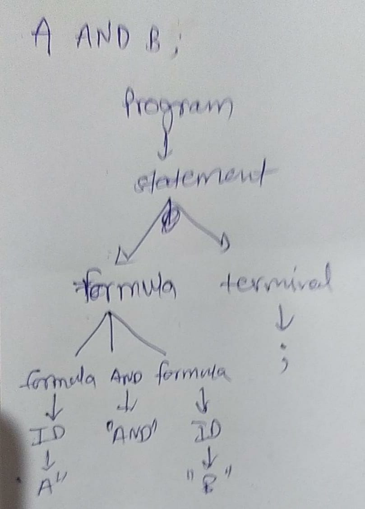

# Assignemnt - 2

### To run type:

```bash
make run
```

This will create executable by name a2

Run the executable by

```bash
./a2 "filename"
```

- this will print 2 lines.
- First will be tokens identified
- Second will be postorder traversal of tree
- In case of errors extra lines with type of error and location of error is printed
- Terminals : without quotes or angular brackerts
- Non-terminals : with angular brackets
- Actual value of token : with double quotes

### Test Cases:

#### Parser Error:

```bash
IF x EQUALS z THEN TRUE ELSE a a XOR b;
```

syntax error prints following things:

````bash
Syntax Error:1:34:found at ID
unhandled exception: ParseError```
````

first line is list of tokens

second line is syntax error location and token which led to the error

##### Lexer Error:

```bash
IF x EQUALS z1 THEN TRUE ELSE a a XOR b;
```

lexer error produces location of error message:

```bash
[ IF "IF", ID "x", EQUALS "EQUALS", ID "z", Unknown token:1:15:1, unhandled exception: LexError
```

#### Large input:

```bash
IF x EQUALS TRUE THEN TRUE ELSE a IMPLIES B XOR b;
```

```bash
[ IF "IF", ID "x", EQUALS "EQUALS", CONST "TRUE", THEN "THEN", CONST "TRUE", ELSE "ELSE", ID "a", IMPLIES "IMPLIES", ID "B", XOR "XOR", ID "b", TERM ";", ]
"IF", IF, "x", <ID>, <formula>, "EQUALS", EQUALS, "TRUE", <CONST>, <formula>, <formula>, "THEN", THEN, "TRUE", <CONST>, <formula>, "ELSE", ELSE, "x", <ID>, <formula>, "EQUALS", EQUALS, "TRUE", <CONST>, <formula>, <formula>, <formula>, ";", <TERM>, <statement>, <program>
```

#### Manual Parse tree checking:



```bash
A AND B;
```

```bash
[ ID "A", AND "AND", ID "B", TERM ";", ]
"A", <ID>, <formula>, "AND", AND, "B", <ID>, <formula>, <formula>, ";", <TERM>, <statement>, <program>
```

Which matches with the tree generated

#### Assignment test case:

```bash
(xyz IMPLIES FALSE) OR TRUE AND IF A THEN b ELSE c;
```

```bash
[ LPAREN "(", ID "xyz", IMPLIES "IMPLIES", CONST "FALSE", RPAREN ")", OR "OR", CONST "TRUE", AND "AND", IF "IF", ID "A", THEN "THEN", ID "b", ELSE "ELSE", ID "c", TERM ";", ]
"(", LPAREN, "xyz", <ID>, <formula>, IMPLIES, "FALSE", <CONST>, <formula>, RPAREN, )", <formula>, "OR", OR, "TRUE", <CONST>, <formula>, <formula>, "AND", AND, "IF", IF, "A", <ID>, <formula>, "THEN", THEN, "b", <ID>, <formula>, "ELSE", ELSE, "A", <ID>, <formula>, <formula>, <formula>, ";", <TERM>, <statement>, <program>
```
